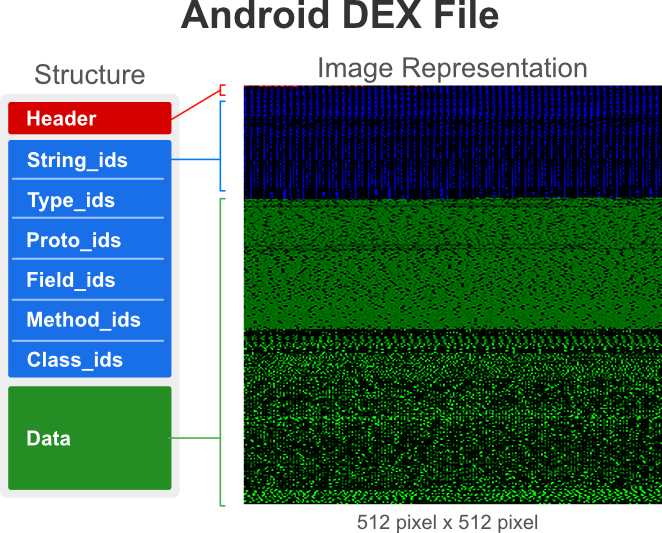
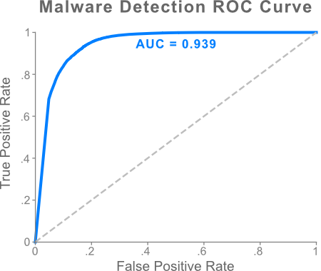
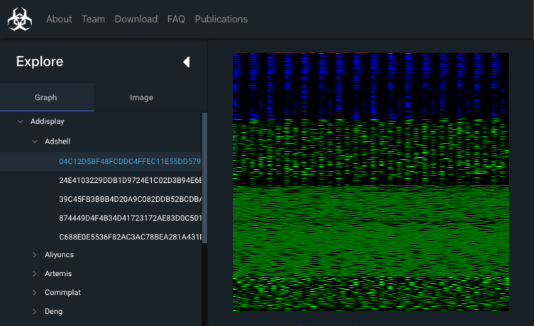

# MalNet: A Large-Scale Cybersecurity Image Database of Malicious Software

Computer vision is playing an increasingly important role in automated malware detection with to the rise of the 
image-based binary representation. These binary images are *fast to generate*, *require no feature
engineering*, and are *resilient to popular obfuscation methods*.
Unfortunately, **malware image databases have been restricted to small-scale or private 
datasets that only a few industry labs have access to**.

To solve these issues, we have been working to develop the worlds largest public binary image 
database to date at Georgia Tech’s [Polo Club of Data Science](https://poloclub.github.io/).
We release **[MalNet](https://www.mal-net.org)**, which contains over **1.2 binary images**
across a hierarchy of 47 types and 696 families of classes. Compared to the popular [Malimg](https://vision.ece.ucsb.edu/research/signal-processing-malware-analysis) 
database, MalNet offers **133x more images**, and **27x more classes**.

Check out the full paper on [arXiv]()!

## What is a binary image?

Binary images represent the bytecode of an executable as a 2D image (see figure below), and can be statically extracted from 
many types of software (e.g., EXE, PE, APK). We use the Android ecosystem due to its large market share, easy 
accessibility, and diversity of malicious software.
With the generous permission of the [AndroZoo](https://androzoo.uni.lu/) we collected 1,262,024 Android APK files, 
specifically selecting APKs containing both a family and type label obtained from 
the [Euphony](https://github.com/fmind/euphony) classification structure.

## What can we do with these images?
Great question! The scale and diversity of the MalNet database offers researchers and practioners 
the ability to conduct industry-scale experiments on **malware detection** and **classification**
using binary images. In addition, MalNet offers researchers a chance to: 
    
- study **imbalanced classification** on a large-scale cybersecurity database with a natural 
imbalance ratio of 16,901x,
- explore **explainability research** in a high impact domain, where it is critical that 
security analysts can interpret and trust the model,
- and investigate **zero-shot learning** techniques in a constantly evolving landscape, where detecting and categorizing new variants of malware can be a measure of national security.

## How do we download and explore MalNet?
We have designed and developed **[MalNet Explorer](https://www.mal-net.org/explore)**, an interactive 
visualization tool to help users explore the data before downloading.
Figure 3 shows MalNet Explorer’s desktop web interface and its main components. 
MalNet Explorer and the data is available online at: www.mal-net.org.

We also release **MalNet Tiny**, a small-scale version of MalNet to help users rapidly prototype 
new ideas in a fraction of the time. MalNet Tiny can be downloaded from the MalNet [website](www.mal-net.org).

## How to run the code?
1. Pre-processing functions to parse the train/val/test split information from the MalNet website, along with 
functions to load the data into Keras are in preprocess.py. 

2. The experiments from the [arXiv paper](https://arxiv.org/abs/2011.07682) can be run using main.py.

